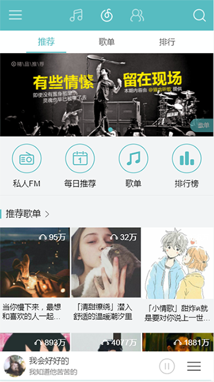
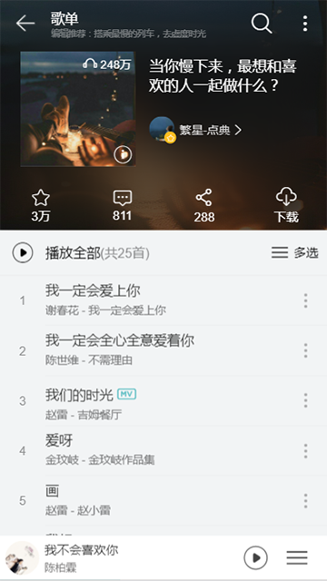
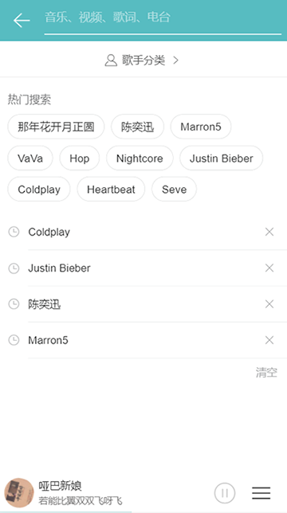
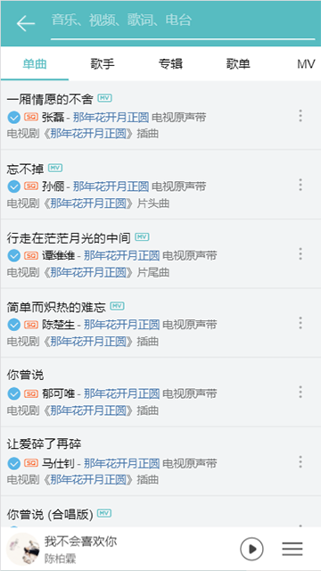
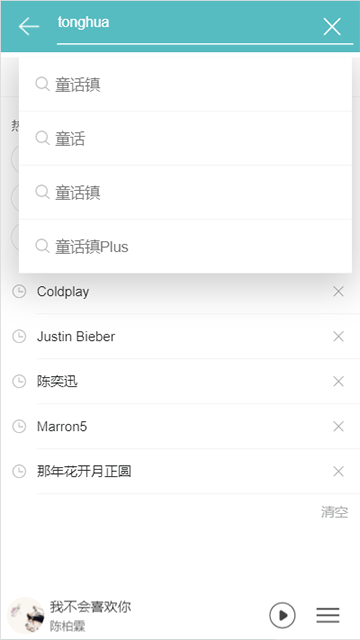
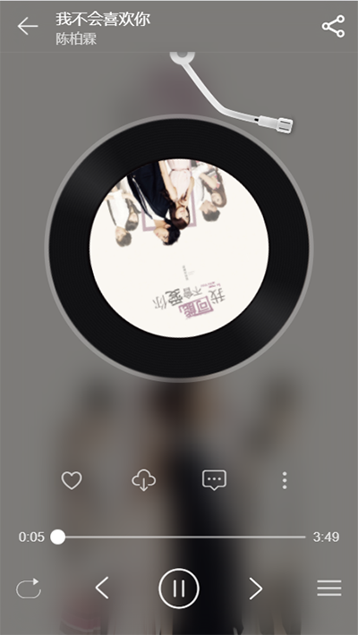
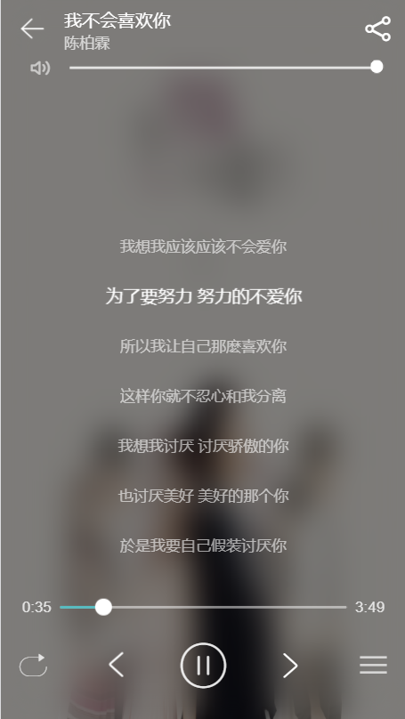
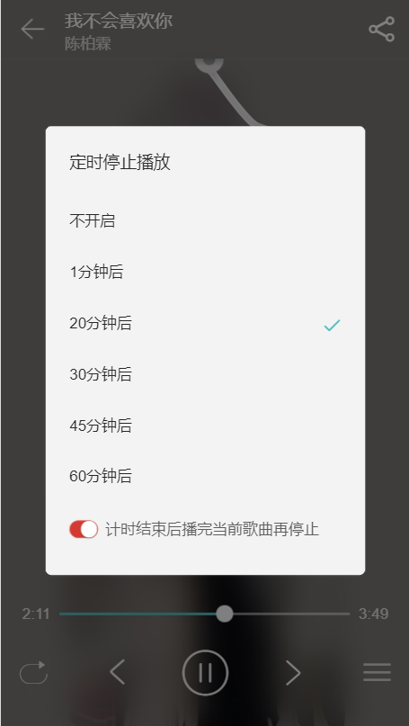
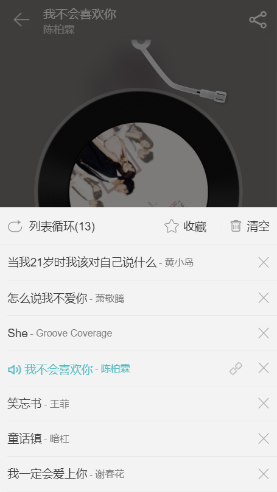
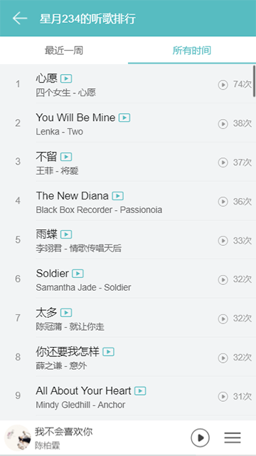

# 仿网易云音乐

> this is a cloud-music webapp

## 数据来源
* 感谢binaryify提供不断维护的数据
> [api数据来源](https://binaryify.github.io/NeteaseCloudMusicApi/#/)

### 项目描述

* 本项目主要模仿网易云音乐UI，以音乐为中心，实现了播放，搜索，登录，个人中心，收藏，喜欢等功能，建议在chrome开发模式浏览

### 项目依赖

*  **vue+vue-router+vuex+iscroll+vue-iscroll-view+mint-ui+axios+fastclick+vue-awesome-swiper**

####  布局
* 结合 rem 和 scale 自动缩放，实现在移动端更高清的视觉效果
* flex布局

#### 内容

>  模块一：首页
* 轮播图，利用swiper组件构建的vue-awesome-swiper实现，推荐歌单，独家放送，最新音乐




> 模块二：歌单
* 在iscroll基础上实现了滚动，该组件同样用于歌单详情页，个人中心页等，下滑到底部会自动加载更多内容，没有内容了则显示全部加载完成,切换到排行页面时，之前加载的歌单页会缓存下来，并且滚动条停留在原来的位置




> 模块三：排行
* 分为官方榜和全球榜，点击可以显示该排行所有音乐


> 模块四：歌单详情
*  顶部导航固定，滑动时背景变色，如果标题文字太长则滚动显示
*  点击播放，点击右侧更多，可以将该歌曲添加到下一首播放，出现在播放列表中，可以收藏该歌曲到我的歌单，点击播放全部将全部播放歌单内歌曲

* 点击搜索可以搜索该歌单内歌曲，实时显示


> 模块五：搜索

* 搜索历史通过本地存储实现，可以删除，全部清空，点击热门搜索，历史记录搜索可以跳转到搜索页面

* 输入内容时，可以实时显示搜索建议，点击搜索建议或者按enter可以跳转到搜索页面



> 模块六：搜索页

* 搜索分类为单曲，歌手，专辑，歌单等

* 因为搜索内容太多，所以也实现了缓存功能，下拉可以加载更多，并显示加载动画，加载完成则停止加载，搜索关键词会高亮显示，点击右侧更多按钮可以将单曲添加到下一首播放，可以添加收藏，点击单曲可以播放

* 顶部搜索框输入内容可以重新搜索，并覆盖之前的搜索内容






> 模块七：播放

* 点击播放音乐，CD旋转，播放时间显示，歌词滚动显示，底部滑块控制播放进度，顶部滑块控制声音大小，都可以拖动，点击控制


* 点击喜欢可以喜欢该歌曲（需要登录），并提示，点击右侧更多，可以收藏该单曲，可以点击设置定时停止播放，设定后出现倒计时，倒计时结束即停止播放

*  点击底部右侧icon可以显示当前播放列表，点击左右切换可以在播放列表里切歌，点击左侧icon可以实现列表循环，随机播放，单曲循环播放模式，并提示

* 点击中间可以在CD和歌词页面间切换，暂停播放时动画停留，并在下次播放时继续








> Mini播放器
* 整个app底部都有一个迷你播放器，最底部1px线条显示播放进度，同时歌词在单曲名字下动态显示，底部图片360度旋转
* 另外加了个或许用处不大的小功能，点击底部旋转的图片可以显示字体稍大一点的动态歌词，歌词可以在屏幕范围内自由拖拽，再次点击图片则隐藏歌词


> 模块八：播放列表
* 同样可以控制播放模式，点击小叉叉可以从本地存储删除该歌曲，点击清空可以从本地存储清空所有单曲，正在播放的单曲高亮显示，同时点击链接可以链接当前单曲到我的听歌排行，并滚动到该单曲位置




> 模块九：个人中心

* 我的听歌排行，刚刚喜欢的音乐，刚才添加的收藏都可以在这里看到，点击查看可以显示所有单曲并播放等，其中歌单包括我创建的歌单和收藏的歌单

* 个人动态查看，时间，描述，音乐，点赞数量，评论数量都可以在这里查看

* 关于我，显示个人信息，地区，等级，手机，账号绑定信息等，没错，下面是我的手机号兼微信号，鄙人也是小白一枚，欢迎骚扰一起讨论技术问题

* 我的听歌排行，包括最近一周，和所有时间100首





#### 项目感想

* 通过这个播放器的锻炼，让我对Vue组件数据通信，生命周期钩子，vuex数据绑定机制，和vue-router的事件钩子有了更深刻的理解，同时也有更多的疑惑，我确信，多写项目，多向牛人学习，总有一天，技术水平会更上一层楼的。


#### 遗留

* 项目中还有一些组件没有很好的分类，在组件复用和内容管理上还需进一步调整，在路由嵌套，状态管理上还需要更好的分类，还有几个小功能待完成：例如换肤，夜间模式，驾驶模式这些


## Build Setup

``` bash
# install dependencies
npm install

# serve with hot reload at localhost:8080
npm run dev

# build for production with minification
npm run build

# build for production and view the bundle analyzer report
npm run build --report

# run unit tests
npm run unit

# run e2e tests
npm run e2e

# run all tests
npm test
```

